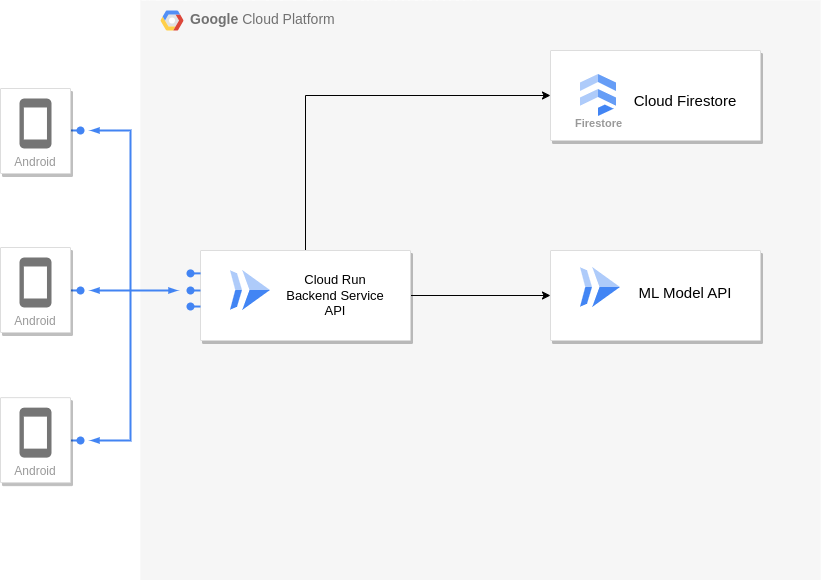

# Cloud Computing Branch

## Introduction

- ## [📑&nbsp;&nbsp;API Docs &rarr;](https://app.swaggerhub.com/apis-docs/LANGARIRANO/capstone/)
## Installation

To install the backend application, follow these steps:

1. Clone the repository.
2. Navigate to the backend directory.
3. Run the following command to install the dependencies:
4. `npm install`
5. Start the server with `npm run start`
